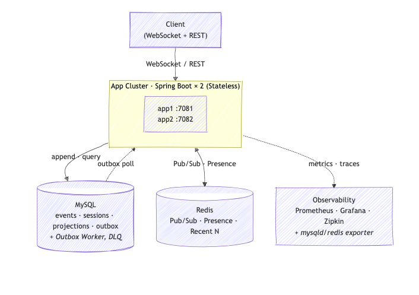
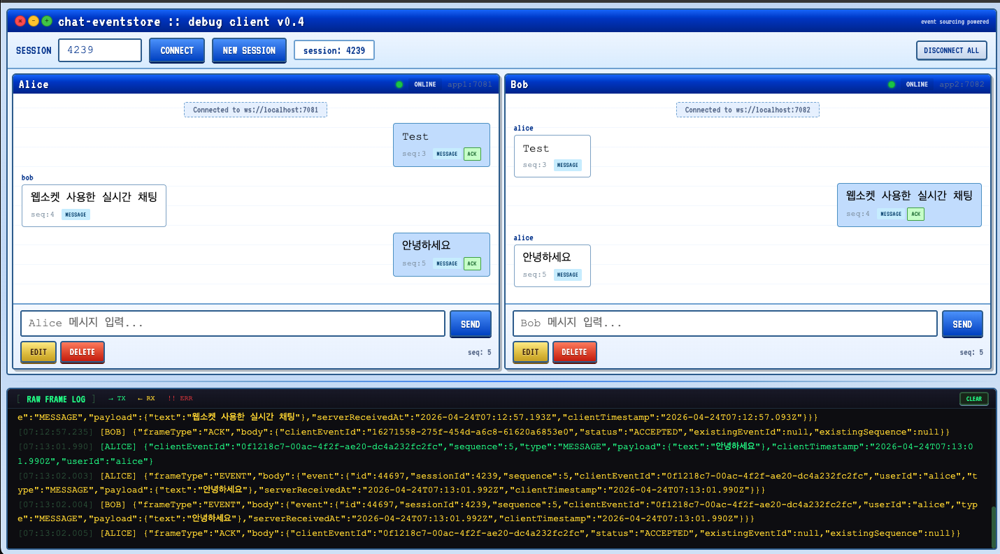
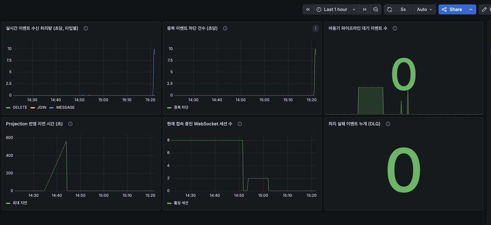
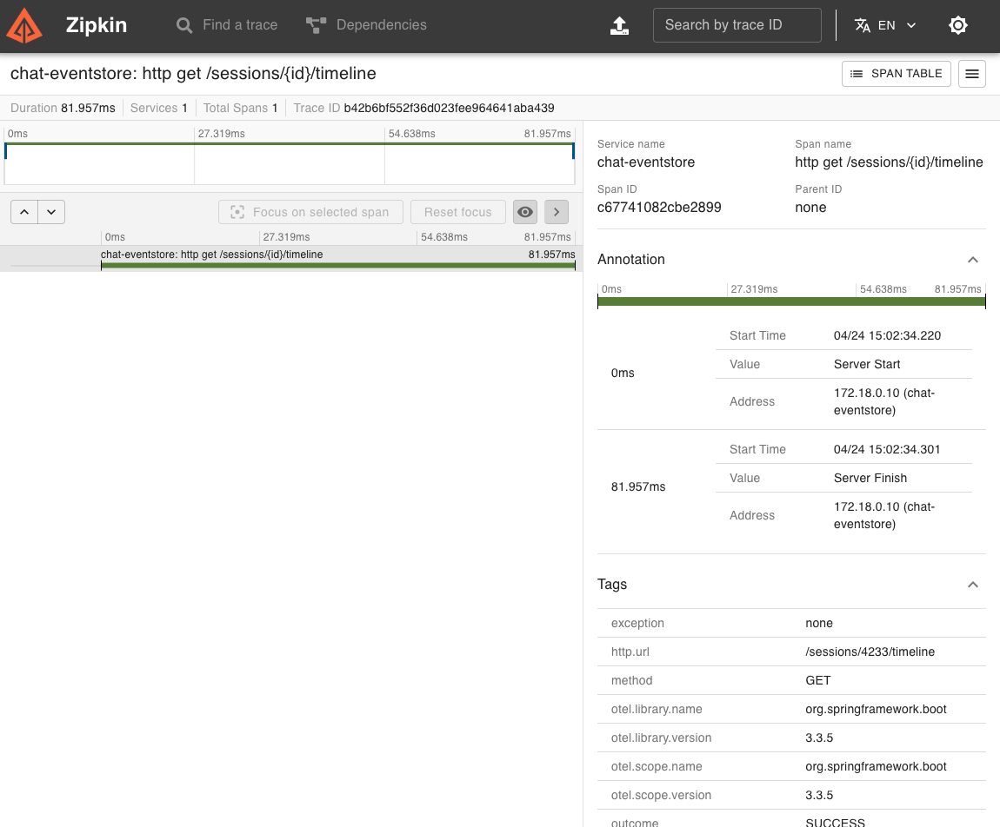

# chat-eventstore

1:1 실시간 채팅 + 이벤트 기반 상태 복원 백엔드 (Spring Boot 3.3, Java 21)

WebSocket 실시간 통신과 이벤트 소싱을 이용한 특정 시점 상태 복원, 중복/순서 처리, 수평 확장, DB 설계 및 쿼리 최적화 패턴을 다룬다.

---

## 시스템 아키텍처



상세 구성 요소와 데이터 흐름은 [docs/02-architecture.md](docs/02-architecture.md) 참조.

---

## 데모 — 로컬 디버그 UI

서로 다른 인스턴스(app1:7081 ← Alice, app2:7082 ← Bob)에 접속한 두 클라이언트가 Redis Pub/Sub을 통해 실시간 동기화되는 모습. 하단 RAW FRAME LOG에서 TX/RX/ACK 프레임 원본을 직접 확인할 수 있다 — **수평 확장(Stateless + Pub/Sub) 동작 검증용**.



- **좌 Alice · 우 Bob** — 각기 다른 앱 인스턴스에 WebSocket 연결
- **ACK 배지** — 발신자 측에만 표시됨. 서버가 `events` 테이블 INSERT 성공을 발신자에게 돌려주는 프레임이며, 수신자에게 전달되는 `EVENT` 프레임과는 별개. 수신자 측 "읽음 표시"는 범위 외.
- **실행:** `docker compose up -d` 후 [`http/chat-debug-ui.html`](http/chat-debug-ui.html)을 브라우저에서 연다.

---

## 요구사항

| 요구사항 | 구현 위치 | 관련 문서 |
|---|---|---|
| 실시간 통신 (WebSocket) | `realtime/` · `/ws/chat` | [04-api-spec](docs/04-api-spec.md) |
| 이벤트 소싱 + 시점 복원 | `event/`, `restore/` | [05-event-sourcing](docs/05-event-sourcing.md) |
| 중복 방지 · 순서 처리 | `UNIQUE(session_id, client_event_id)` + PK `(session_id, sequence)` | [05-event-sourcing](docs/05-event-sourcing.md) |
| 수평 확장 | 앱 2대 Stateless + Redis Pub/Sub + Outbox SKIP LOCKED | [02-architecture §6](docs/02-architecture.md) |
| 관측 가능성 | Metrics · Logs · Traces 3요소 | [07-observability](docs/07-observability.md) |
| 장애 대응 | 3가지 시나리오 (감지 → 완화 → 복구) | [08-failure-scenarios](docs/08-failure-scenarios.md) |
| DB 설계 · 쿼리 최적화 | Flyway V1~V5 · EXPLAIN 분석 | [03-db-schema](docs/03-db-schema.md) · [10-query-optimization](docs/10-query-optimization.md) |

---

## 빠른 시작

```bash
./gradlew bootJar
docker compose up -d --build
./scripts/reproduce.sh
```

헬스체크: `curl http://localhost:7081/actuator/health`

---

## 주요 서비스 URL

| 서비스 | URL | 비고 |
|---|---|---|
| app1 / app2 | http://localhost:7081 · http://localhost:7082 | Spring Boot 2대 |
| Swagger UI | http://localhost:7081/swagger-ui.html | REST API 문서 |
| Grafana | http://localhost:3100 | admin/admin |
| Prometheus | http://localhost:9190 | — |
| Zipkin | http://localhost:9411 | — |

---

## 핵심 기술 선택

| 주제 | 선택 | 근거 |
|---|---|---|
| 실시간 통신 | 순수 WebSocket | 자체 이벤트 스키마(`clientEventId`/`sequence`/`clientTimestamp`) 설계, STOMP 프레임 제약 회피 |
| 주 DB | MySQL 8.x | InnoDB clustered index `(session_id, sequence)`로 세션별 순차 I/O 최적화 |
| ORM | JPA + QueryDSL | append-only 구조에 적합, Native SQL은 SKIP LOCKED 1곳만 사용 |
| 비동기 파이프라인 | DB 아웃박스 + `@Scheduled` + SKIP LOCKED | 이중 쓰기 문제 원천 차단, DB 단일 장애 도메인 |
| Redis 역할 | Pub/Sub · Presence TTL · Recent N | 3가지 한정 (YAGNI) |
| 관측 스택 | Micrometer + Prometheus + Grafana + Zipkin | Metrics/Logs/Traces 3요소 전부 구현 |

9개 ADR 상세 근거: [docs/01-overview-and-decisions.md](docs/01-overview-and-decisions.md)

---

## 패키지 구조 (요약)

```
src/main/java/com/example/chat/
├── session/     # 세션 도메인 (CRUD API)
├── event/       # 이벤트 수집 (WebSocket + HTTP fallback)
├── projection/  # 아웃박스 워커, projection, snapshot
├── realtime/    # WebSocket 핸들러, Redis Pub/Sub
├── presence/    # Redis TTL 기반 온라인 상태
├── restore/     # 특정 시점 상태 복원 API
└── common/      # 설정, 예외, 필터, 메트릭
```

전체 트리 및 패키지별 세부 책임: [docs/02-architecture.md §5](docs/02-architecture.md)

---

## 주요 API

| 메서드 | 엔드포인트 | 설명 |
|---|---|---|
| POST | `/sessions` | 세션 생성 |
| POST | `/sessions/{id}/join` · `/end` | 참여 / 종료 |
| POST | `/sessions/{id}/events` | HTTP fallback (WebSocket 불가 시) |
| GET | `/sessions/{id}/timeline?at=...` | 특정 시점 상태 복원 |
| GET | `/sessions` | 세션 목록 (status/from/to/participant 필터) |
| POST | `/admin/projections/rebuild?sessionId=X` | Projection 재계산 |
| GET | `/admin/dlq` | Dead Letter Queue 조회 |
| WS | `/ws/chat?sessionId=X&userId=Y&lastSequence=N` | 실시간 채팅 |

전체 스펙: [openapi/openapi.yaml](openapi/openapi.yaml) · 상세 프로토콜: [docs/04-api-spec.md](docs/04-api-spec.md)

---

## 관측 가능성

Metrics(Micrometer → Prometheus → Grafana 대시보드 3종), Logs(Logback JSON + MDC), Traces(Micrometer Tracing → OTel → Zipkin)를 모두 구현. 상세 구성: [docs/07-observability.md](docs/07-observability.md)





---

## 설계 문서

| # | 문서 | 요약 |
|---|---|---|
| 01 | [개요 + ADR](docs/01-overview-and-decisions.md) | 9개 ADR 및 기술 선택 근거 |
| 02 | [아키텍처 + 도메인](docs/02-architecture.md) | 논리 아키텍처, 도메인 모델, 데이터 흐름 |
| 03 | [DB 스키마](docs/03-db-schema.md) | DDL, ERD, 인덱스 전략 |
| 04 | [API 명세](docs/04-api-spec.md) | REST + WebSocket 프로토콜 상세 |
| 05 | [이벤트 소싱 전략](docs/05-event-sourcing.md) | 중복/순서/복원, Tombstone, GDPR 설계 |
| 06 | [비동기 파이프라인](docs/06-async-pipeline.md) | Outbox 워커, rebuild API, rate limit |
| 07 | [관측 가능성](docs/07-observability.md) | Metrics/Logs/Traces 구성 및 대시보드 |
| 08 | [장애 시나리오](docs/08-failure-scenarios.md) | 3가지 장애: 감지 → 완화 → 복구 |
| 09 | [테스트 + 부하](docs/09-testing-and-load.md) | 단위/통합/k6 부하 테스트 |
| 10 | [쿼리 최적화](docs/10-query-optimization.md) | EXPLAIN 분석, 인덱스 활용 |
| 11 | [AI 하네스 엔지니어링](docs/11-ai-harness-engineering.md) | 개발 방법론 회고 |

---

## 테스트 및 부하

```bash
./gradlew test                    # 단위 + 통합 (Testcontainers)
k6 run scripts/load-test.js       # 부하 테스트
```

전략 및 시나리오 상세: [docs/09-testing-and-load.md](docs/09-testing-and-load.md)

---

## 구현 범위 외 (설계 문서만 존재)

- JWT/OAuth2 인증 체계 (쿼리 파라미터 기반으로 대체)
- Kafka 기반 스트리밍 파이프라인 (DB 아웃박스로 대체)
- GDPR / 탈퇴 사용자 crypto-shredding (설계: [docs/05](docs/05-event-sourcing.md))
- Hot/Warm/Cold 스토리지 티어링 (설계: [docs/06](docs/06-async-pipeline.md))
- Rate Limiting / Backpressure (설계: [docs/06](docs/06-async-pipeline.md))
- 자동 페일오버 (시나리오: [docs/08](docs/08-failure-scenarios.md))
- 1:N 채팅, 파일 첨부, WebRTC

---

## 제약 및 알려진 한계

- 인증: 쿼리 파라미터 기반 최소 식별 (과제 Non-goals)
- 1:1 채팅 전용 (1:N은 범위 외)
- 부하 테스트 환경: 단일 노트북 기준 → p99 threshold는 참고치

---

## 보안 주의

로컬 실행 편의를 위해 비밀번호/설정을 평문 포함. 운영 환경에서는 반드시 Secrets Manager / 환경 변수 주입으로 교체.

로그 확인: `docker compose logs -f app1`
