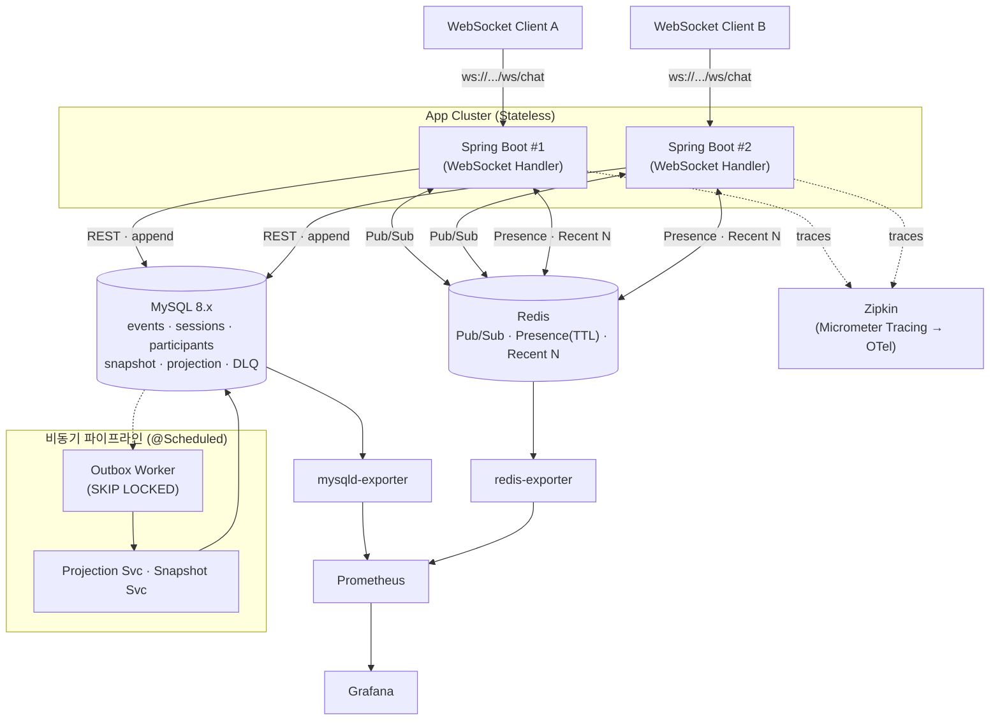

# 02. 아키텍처 및 도메인 모델

## 1. 논리 아키텍처



## 2. 주요 트래픽 흐름

### (A) 이벤트 수집 플로우
1. Client가 WebSocket으로 메시지 frame 전송 (`{ clientEventId, sequence, type, payload }`)
2. Spring Boot가 `events` 테이블에 INSERT
   - `UNIQUE(session_id, client_event_id)` 위반 시 중복으로 판단, 무시
   - `projection_status = 'PENDING'` 설정
3. **같은 트랜잭션 내** 에서 Redis `PUBLISH session:{id}`로 즉시 broadcast
4. 다른 Spring Boot 인스턴스에 연결된 참여자들에게 메시지 전달
5. 이후 아웃박스 워커가 projection/snapshot 업데이트

### (B) 재연결 / Resume 플로우
1. Client가 재연결, `?lastSequence=N` 파라미터 전달
2. 서버가 Redis `session:{id}:recent` Sorted Set 확인
3. 캐시 hit: Sorted Set에서 `score > N` 항목 즉시 전달
4. 캐시 miss: MySQL `events`에서 `sequence > N` 조회 후 전달

### (C) 상태 복원 플로우
1. `GET /sessions/{id}/timeline?at=2026-04-21T15:00:00Z`
2. 가장 가까운 이전 snapshot 로드 (없으면 빈 상태)
3. snapshot 이후부터 `at` 까지의 이벤트 리플레이
4. 결과 상태 반환 (참여자 목록, 메시지 목록, 메시지별 상태)

## 3. 도메인 모델

### 3.1 Aggregate

**Session (집약 루트)**
- sessionId (PK)
- status: `ACTIVE`, `SUSPENDED`, `ENDED`
- createdAt, endedAt
- lastSequence (최대 시퀀스, 낙관적 락)

**Participant**
- id (PK)
- sessionId (FK)
- userId
- joinedAt, leftAt
- presenceStatus: `ONLINE`, `OFFLINE` (Redis 반영)

**Event (append-only)**
- id (PK, auto increment)
- sessionId
- clientEventId (멱등키)
- sequence (세션 내 순서)
- type: `MESSAGE`, `JOIN`, `LEAVE`, `DISCONNECT`, `RECONNECT`, `EDIT`, `DELETE`
- payload (JSON)
- clientTimestamp
- serverReceivedAt
- projectionStatus: `PENDING`, `DONE`, `FAILED` (처리 중 상태는 별도 값 없이 `SELECT ... FOR UPDATE SKIP LOCKED` 행 락으로 대체)
- retryCount
- nextRetryAt

**Snapshot**
- sessionId + version (PK)
- stateJson (직렬화된 세션 상태)
- lastEventId (해당 snapshot까지 반영된 이벤트)
- createdAt

**SessionProjection (읽기 모델)**
- sessionId (PK)
- participantCount
- messageCount
- lastMessageAt
- lastAppliedEventId

**DeadLetterEvent**
- id (PK)
- originalEventId
- sessionId
- error, stackTrace
- failedAt
- retryCount

### 3.2 이벤트 타입 카탈로그

| type | payload 예시 | 비고 |
|---|---|---|
| `MESSAGE` | `{ "text": "hi" }` | 기본 메시지 |
| `JOIN` | `{ }` | 참여자 입장 |
| `LEAVE` | `{ }` | 참여자 퇴장 |
| `DISCONNECT` | `{ "reason": "timeout" }` | 일시 단절 |
| `RECONNECT` | `{ "lastSeq": 123 }` | 재연결 |
| `EDIT` | `{ "targetEventId": 10, "text": "fixed" }` | 메시지 수정 |
| `DELETE` | `{ "targetEventId": 10 }` | 메시지 삭제 |

### 3.3 이벤트 스키마 (WebSocket 클라이언트 프레임 — `ClientEventFrame`)

```json
{
  "clientEventId": "uuid-v4",
  "sequence": 17,
  "type": "MESSAGE",
  "payload": { "text": "hello" },
  "userId": "alice",
  "clientTimestamp": "2026-04-21T15:00:00.123Z"
}
```

**필드 설명:**
- `sessionId`는 프레임에 포함하지 않는다 — 핸드셰이크 쿼리 파라미터(`?sessionId=...`)에서 받아 `WebSocketSession.attributes`로 전달된다.
- `clientEventId`: 클라이언트 생성 UUID, 중복 방지 멱등키
- `sequence`: 세션 내 단조 증가, 클라이언트가 생성 (재전송 시 동일 유지)
- `userId`: 핸드셰이크에서 이미 알고 있으므로 생략 가능, 보내도 무시됨
- `clientTimestamp`: 클라이언트 시각 정보 (정렬에는 사용하지 않음 — PK `(session_id, sequence)`가 결정론을 보장)
- `serverReceivedAt` (서버 주입): 특정 시점 복원 쿼리에 사용 (`server_received_at <= :at`)

서버 → 클라이언트 프레임은 모두 `{ "frameType": "...", "body": {...} }` envelope으로 직렬화된다. 자세한 구조는 `docs/04-api-spec.md` §3.4 참조.

## 4. 프로젝트 최상위 구조

```
chat-eventstore/
├── README.md                      # 실행 방법, 주요 의사결정 요약
├── build.gradle
├── settings.gradle
├── docker-compose.yml
├── Dockerfile
├── src/
│   ├── main/
│   │   ├── java/com/example/chat/ # (아래 패키지 구조 참고)
│   │   └── resources/
│   │       ├── application.yml
│   │       ├── logback-spring.xml
│   │       └── db/migration/       # Flyway
│   └── test/
│       └── java/com/example/chat/
├── docs/                          # 모든 설계 문서 (README 제외)
│   ├── 01-overview-and-decisions.md   # ADR 통합본
│   ├── 02-architecture.md
│   ├── 03-db-schema.md
│   ├── 04-api-spec.md             # OpenAPI 링크 + 한국어 해설
│   ├── 05-event-sourcing.md       # 중복/순서/복원 전략
│   ├── 06-async-pipeline.md       # 아웃박스 + DLQ
│   ├── 07-observability.md
│   ├── 08-failure-scenarios.md
│   ├── 09-testing-and-load.md
│   ├── 10-query-optimization.md   # 주요 쿼리 + 인덱스 근거 + EXPLAIN
│   ├── 11-ai-harness-engineering.md  # 4역할 AI 페어 프로그래밍 회고
│   ├── images/                    # 대시보드 스크린샷 등 (CAPTURE.md 가이드 포함)
│   └── load-test-results/         # k6 결과 JSON
├── openapi/
│   └── openapi.yaml               # 영어 표준 스펙
├── scripts/
│   ├── reproduce.sh
│   └── load-test.js               # k6
├── http/                          # IntelliJ http client / VSCode REST Client
│   ├── create-session.http
│   ├── send-event.http
│   └── restore-timeline.http
└── observability/
    ├── prometheus/
    │   └── prometheus.yml
    ├── grafana/
    │   ├── provisioning/
    │   └── dashboards/
    └── zipkin/                    # (선택) 설정 있으면
```

**운영 원칙:**
- `README.md`는 **프로젝트 최상위에 고정** — 실행법/주요 의사결정 요약만.
- 모든 설계 문서 / ADR / 장애 시나리오 / 테스트 전략 등은 **`docs/` 하위에서 관리**.
- 다이어그램 소스(mermaid)와 이미지는 `docs/diagrams/`, `docs/images/` 로 분리.
- OpenAPI는 **코드/문서와 분리된 `openapi/` 디렉토리**에서 버전 관리.
- 계획 수립 중인 본 `.omc/plans/` 문서는 **최종 제출 시 `docs/`로 이관**하거나 **ADR 형태로 요약** 해서 병합.

## 5. 패키지 구조 상세

실제 코드 기준 (관측/MDC 관련 클래스는 `common/` 하위에 집약, 별도 `observability/` 패키지 없음).

```
com.example.chat
├── ChatEventStoreApplication.java
├── common/
│   ├── config/            # SchedulingConfig, WebSocketConfig, RedisConfig, WebMvcConfig, QueryDslConfig
│   ├── exception/         # GlobalExceptionHandler + 도메인 예외 + ErrorCode/ErrorResponse
│   ├── filter/            # MdcFilter (요청별 MDC traceId/sessionId 주입)
│   └── metrics/           # ChatMetrics — 6종 커스텀 메트릭 (docs/07 참조)
├── session/
│   ├── controller/        # SessionController — POST/GET /sessions, POST /sessions/{id}/{join,end}
│   ├── service/           # SessionService — JOIN 이벤트 자동 append, 종료 시 final snapshot
│   ├── repository/        # SessionRepository, SessionQueryRepository(Impl) — QueryDSL 동적 필터
│   ├── dto/
│   └── domain/            # Session, Participant, SessionStatus
├── event/
│   ├── controller/        # SessionEventController — POST /sessions/{id}/events (fallback)
│   ├── service/           # EventAppendService — UNIQUE 제약 기반 멱등 + sequence 검증
│   ├── repository/        # EventRepository, EventIdProjection
│   ├── dto/
│   └── domain/            # Event, EventType, ProjectionStatus, EventId
├── projection/
│   ├── worker/            # OutboxPoller — 2단계 트랜잭션 + SKIP LOCKED
│   ├── service/           # ProjectionService, SnapshotService, ProjectionRebuildService, StateEventApplier
│   ├── controller/        # AdminProjectionController, DlqAdminController
│   ├── config/            # SnapshotObjectMapperConfig (전용 ObjectMapper Bean)
│   ├── repository/        # SessionProjectionRepository, SnapshotRepository, DeadLetterEventRepository
│   ├── dto/
│   └── domain/            # SessionProjection, Snapshot, DeadLetterEvent
├── realtime/
│   ├── handler/           # ChatWebSocketHandler (FrameEnvelope으로 응답 직렬화)
│   ├── interceptor/       # ChatHandshakeInterceptor (sessionId/userId/lastSequence 검증)
│   ├── registry/          # SessionRegistry (in-memory Map)
│   ├── pubsub/            # RedisMessagePublisher, RedisMessageSubscriber
│   ├── service/           # RecentCacheService, ResumeService
│   └── dto/               # ClientEventFrame, EventBroadcastFrame, AckFrame, ErrorFrame, ResumeBatchFrame, PresenceFrame
├── presence/
│   └── service/           # PresenceService (Redis SET + TTL). 별도 scheduler/heartbeat 없음.
└── restore/
    ├── controller/        # SessionTimelineController — GET /sessions/{id}/timeline
    ├── service/           # EventReplayService — Snapshot + Replay 하이브리드
    └── dto/               # TimelineResponse
```

**없는 것 정정:**
- `observability/` 패키지는 없다. 메트릭은 `common/metrics/ChatMetrics`, MDC 주입은 `common/filter/MdcFilter` + `OutboxPoller` 내부 직접 호출, 추적은 Spring Boot Actuator + Micrometer Tracing의 자동 설정에 의존.
- `event/service/`에 `DuplicateDetector`, `OrderingService` 같은 별도 클래스 없음 — 모두 `EventAppendService` 내부에서 `UNIQUE(session_id, client_event_id)` 제약과 `sessions.last_sequence` 비교로 구현.
- `presence/scheduler/` 없음 — heartbeat는 미구현, presence는 Redis TTL만으로 만료 처리.
- `restore/service/SnapshotReplayService` 없음 — `EventReplayService` 단일 클래스가 스냅샷 로드 + 이벤트 리플레이를 모두 담당.
- WebSocket 응답 직렬화는 핸들러 내부 `FrameEnvelope` private record가 처리하므로 별도 클래스 불필요.

## 6. 수평 확장 전략

- 앱 서버는 **무상태** 가정 (로컬 Map은 연결된 클라이언트 WebSocket만 관리, 진실의 원천 아님)
- 메시지 전달은 **Redis Pub/Sub**으로 모든 인스턴스에 broadcast
- 각 인스턴스는 **자신이 보유한 WebSocket 세션**에만 실제 전송
- Presence는 Redis TTL로 중앙 관리
- 아웃박스 워커는 모든 인스턴스에서 실행되며 `SKIP LOCKED`로 경합 없음
- 세션 sticky 라우팅 **불필요** → 로드 밸런서 단순화

## 7. 트랜잭션 경계

| 작업 | 트랜잭션 경계 |
|---|---|
| 이벤트 insert + Redis publish | DB 트랜잭션 commit 후 publish (최소 1회 전달 보장) |
| projection 업데이트 | 단일 트랜잭션 내 `events.status` 변경 + `session_projection` 업데이트 |
| snapshot 생성 | 별도 트랜잭션, idempotent |
| 중복 감지 | `UNIQUE` 제약 + `DataIntegrityViolationException` catch |

## 8. 가정 사항 명시

- 이벤트 페이로드 크기는 < 4KB (MySQL `JSON` 타입 권장 범위)
- 동시 활성 세션 수: < 1,000 (일주일 과제 수준)
- 이벤트/초: < 100 (설계 기준치, 실제 부하 테스트로 검증)
- 세션당 최대 이벤트 수: < 100,000 (스냅샷 주기 설계 참고치)
