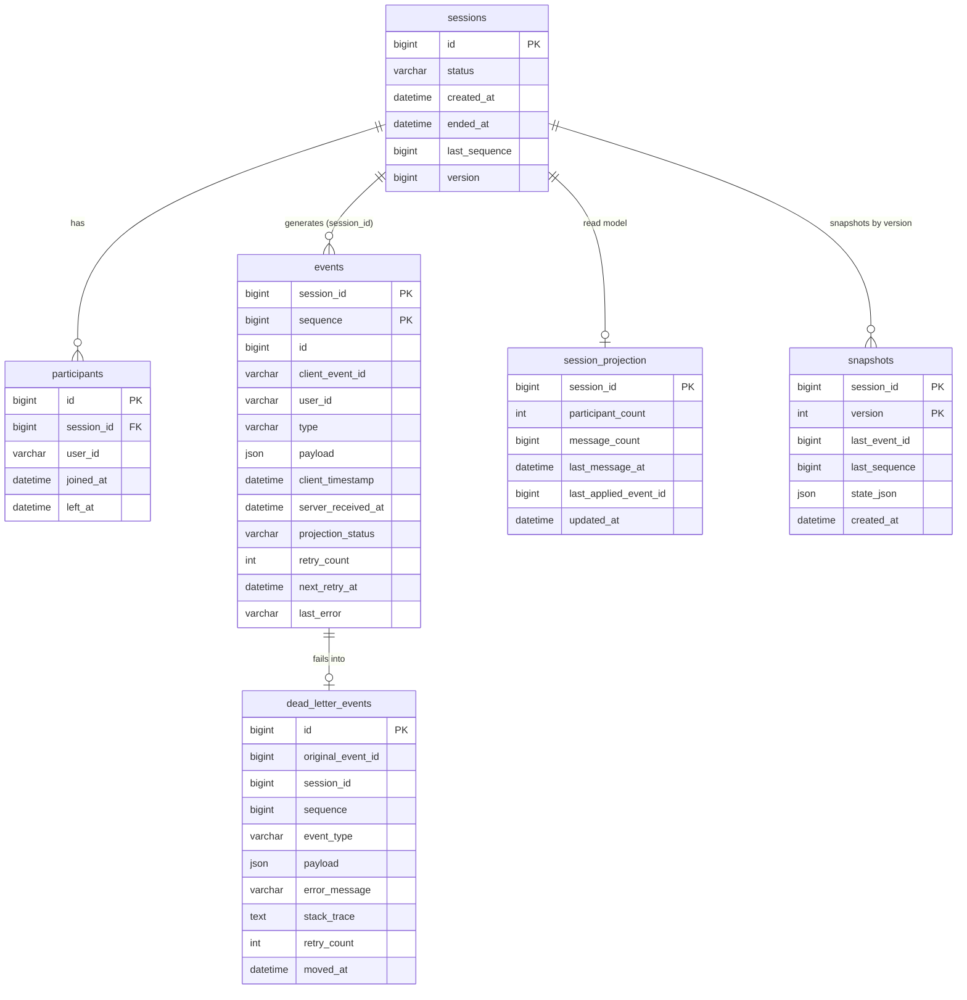

# 03. DB 스키마 및 인덱스 설계

## 1. ERD (텍스트)

```
 ┌─────────────┐ 1      N ┌──────────────┐
 │  sessions   │──────────│ participants │
 └─────────────┘          └──────────────┘
        │ 1
        │
        │ N
 ┌─────────────┐          ┌───────────────┐
 │   events    │──────────│  snapshots    │
 │ (append-    │          │ (주기 생성)   │
 │  only)      │          └───────────────┘
 └─────────────┘
        │ 1
        │
        │ N
 ┌─────────────────┐
 │session_         │  1:1 (session)
 │projection       │
 └─────────────────┘

 ┌─────────────────┐
 │dead_letter_     │  events 실패 이관
 │events           │
 └─────────────────┘
```

아래는 핵심 엔티티 관계도입니다.



## 2. 핵심 DDL

### 2.1 sessions
```sql
CREATE TABLE sessions (
  id              BIGINT AUTO_INCREMENT PRIMARY KEY,
  status          VARCHAR(20) NOT NULL DEFAULT 'ACTIVE',
  created_at      DATETIME(3) NOT NULL DEFAULT CURRENT_TIMESTAMP(3),
  ended_at        DATETIME(3) NULL,
  last_sequence   BIGINT NOT NULL DEFAULT 0,
  version         BIGINT NOT NULL DEFAULT 0,
  INDEX idx_status_created (status, created_at),
  INDEX idx_created_at (created_at)
) ENGINE=InnoDB DEFAULT CHARSET=utf8mb4;
```

### 2.2 participants
```sql
CREATE TABLE participants (
  id              BIGINT AUTO_INCREMENT PRIMARY KEY,
  session_id      BIGINT NOT NULL,
  user_id         VARCHAR(64) NOT NULL,
  joined_at       DATETIME(3) NOT NULL,
  left_at         DATETIME(3) NULL,
  UNIQUE KEY uk_session_user (session_id, user_id),
  INDEX idx_session (session_id),
  CONSTRAINT fk_participants_session FOREIGN KEY (session_id) REFERENCES sessions(id)
) ENGINE=InnoDB DEFAULT CHARSET=utf8mb4;
```

### 2.3 events (핫 테이블)
```sql
CREATE TABLE events (
  session_id          BIGINT NOT NULL,
  sequence            BIGINT NOT NULL,
  id                  BIGINT NOT NULL AUTO_INCREMENT,
  client_event_id     VARCHAR(64) NOT NULL,
  user_id             VARCHAR(64) NOT NULL,
  type                VARCHAR(20) NOT NULL,
  payload             JSON NOT NULL,
  client_timestamp    DATETIME(3) NOT NULL,
  server_received_at  DATETIME(3) NOT NULL DEFAULT CURRENT_TIMESTAMP(3),
  projection_status   VARCHAR(16) NOT NULL DEFAULT 'PENDING',
  retry_count         INT NOT NULL DEFAULT 0,
  next_retry_at       DATETIME(3) NOT NULL DEFAULT CURRENT_TIMESTAMP(3),
  last_error          VARCHAR(1024) NULL,
  PRIMARY KEY (session_id, sequence),
  UNIQUE KEY uk_id (id),
  UNIQUE KEY uk_session_client_event (session_id, client_event_id),
  INDEX idx_projection_status_retry (projection_status, next_retry_at),
  INDEX idx_session_received (session_id, server_received_at)
) ENGINE=InnoDB DEFAULT CHARSET=utf8mb4;
```

**설계 근거:**
- **PK `(session_id, sequence)`**: InnoDB clustered index 활용 → 세션별 이벤트 리플레이 시 순차 I/O 보장, 복원 핫패스 최적.
- **`id` 보조 UNIQUE**: 단일 이벤트 참조 용이성 (DLQ 이관, 로그 식별).
- **`uk_session_client_event`**: 중복 방지 핵심 제약. 클라이언트 재전송 시 `DataIntegrityViolationException` 발생 → 애플리케이션 무시.
- **`idx_projection_status_retry`**: 아웃박스 워커가 `WHERE projection_status='PENDING' AND next_retry_at <= NOW() ORDER BY ... FOR UPDATE SKIP LOCKED` 조회 시 사용.
- **`idx_session_received`**: `server_received_at` 기반 복원 (과제 4.3 "특정 시점 t" 쿼리)에 사용.
- **JSON 타입 선택 근거**:
  - 이벤트 타입이 7종으로 제한적, payload 스키마는 각 타입 내부에서 단순 → 완전 정규화 테이블 7개는 과설계.
  - MySQL 8.0 JSON은 이벤트 조회 쿼리(payload 내부 접근 거의 없음)에 충분.
  - 트레이드오프: 페이로드 내부 검색/필터는 functional index 필요하나, 본 과제는 필요 없음.

### 2.4 snapshots
```sql
CREATE TABLE snapshots (
  session_id       BIGINT NOT NULL,
  version          INT NOT NULL,
  last_event_id    BIGINT NOT NULL,
  last_sequence    BIGINT NOT NULL,
  state_json       JSON NOT NULL,
  created_at       DATETIME(3) NOT NULL DEFAULT CURRENT_TIMESTAMP(3),
  PRIMARY KEY (session_id, version),
  INDEX idx_session_last_seq (session_id, last_sequence DESC)
) ENGINE=InnoDB DEFAULT CHARSET=utf8mb4;
```

**설계 근거:**
- 스냅샷은 N개 이벤트마다 생성 (기본 100개 주기)
- 복원 시 `(session_id, last_sequence DESC)` 역방향 인덱스로 **가장 최근 스냅샷**을 O(1) 탐색.
- `state_json`에 참여자 목록 + 메시지 집계 + lastSequence 저장.

### 2.5 session_projection (읽기 모델)
```sql
CREATE TABLE session_projection (
  session_id              BIGINT PRIMARY KEY,
  participant_count       INT NOT NULL DEFAULT 0,
  message_count           BIGINT NOT NULL DEFAULT 0,
  last_message_at         DATETIME(3) NULL,
  last_applied_event_id   BIGINT NOT NULL DEFAULT 0,
  updated_at              DATETIME(3) NOT NULL DEFAULT CURRENT_TIMESTAMP(3) ON UPDATE CURRENT_TIMESTAMP(3),
  INDEX idx_last_message_at (last_message_at)
) ENGINE=InnoDB DEFAULT CHARSET=utf8mb4;
```

**설계 근거:**
- `last_applied_event_id`로 멱등성 보장 — projection 적용 시 `WHERE last_applied_event_id < :eventId` 조건으로 중복 적용 방지.
- 세션 목록/필터 쿼리용 집계 값 선계산.

### 2.6 dead_letter_events

V4 최초 생성 후 V6에서 `sequence` 컬럼이 추가되었다. 최종 스키마는 다음과 같다.

```sql
CREATE TABLE dead_letter_events (
  id                  BIGINT AUTO_INCREMENT PRIMARY KEY,
  original_event_id   BIGINT NOT NULL,
  session_id          BIGINT NOT NULL,
  sequence            BIGINT NOT NULL DEFAULT 0,  -- V6에서 추가
  event_type          VARCHAR(20) NOT NULL,
  payload             JSON NOT NULL,
  error_message       VARCHAR(1024) NOT NULL,
  stack_trace         TEXT NULL,
  retry_count         INT NOT NULL,
  moved_at            DATETIME(3) NOT NULL DEFAULT CURRENT_TIMESTAMP(3),
  INDEX idx_session_moved (session_id, moved_at),
  INDEX idx_moved (moved_at),
  INDEX idx_session_sequence (session_id, sequence)  -- V6에서 추가
) ENGINE=InnoDB DEFAULT CHARSET=utf8mb4;
```

**설계 근거:**
- `events.retry_count > MAX_RETRY` 도달 시 이관 (원본 events는 projection_status=FAILED로 마킹, DLQ로는 INSERT).
- 운영자가 수동 재처리할 수 있도록 원본 payload 보존.
- `sequence` 컬럼 추가 근거: DLQ retry API가 원본 events를 복합키 `(session_id, sequence)`로 조회해 PENDING 리셋해야 하므로, 서러게이트 `original_event_id` 대신 복합키로 역조회할 수 있는 경로가 필요. `idx_session_sequence`로 retry 쿼리 효율 확보.

## 3. 주요 쿼리 (과제 4.4 요구)

### 쿼리 1: 아웃박스 워커 이벤트 조회 (핫패스)
```sql
SELECT * FROM events
WHERE projection_status = 'PENDING' AND next_retry_at <= NOW(3)
ORDER BY id ASC
LIMIT 100
FOR UPDATE SKIP LOCKED;
```
- **사용 인덱스**: `idx_projection_status_retry (projection_status, next_retry_at)`
- **예상 병목**: PENDING 이벤트 누적 시 인덱스 cardinality 저하 → 개선 방향: 처리 완료된 오래된 이벤트를 별도 archive 테이블로 주기적 이관 또는 partial index 대체.
- **SKIP LOCKED 이유**: 워커 다수 병렬 실행 시 동일 row 경합 방지.

### 쿼리 2: 특정 시점 복원 (이벤트 리플레이)
```sql
-- (a) at 시점의 최대 sequence 산출
SELECT MAX(sequence) FROM events
WHERE session_id = :sid AND server_received_at <= :at;

-- (b) 가장 가까운 snapshot 찾기 (last_sequence 기준, createdAt 미사용)
--     비동기 스냅샷의 시각 왜곡을 차단하기 위해 lastSequence로 선택한다.
SELECT * FROM snapshots
WHERE session_id = :sid AND last_sequence <= :maxSeq
ORDER BY version DESC
LIMIT 1;

-- (c) snapshot 이후 ~ :at 까지 이벤트 리플레이
SELECT * FROM events
WHERE session_id = :sid
  AND sequence > :snapshotLastSeq
  AND server_received_at <= :at
ORDER BY sequence ASC;
```
- **사용 인덱스**: PK `(session_id, sequence)` + 보조 `idx_session_received` + `snapshots.idx_session_last_seq`
- **정렬 키 단일화 근거**: PK `(session_id, sequence)`가 UNIQUE이므로 tiebreaker(`server_received_at`, `id`) 불필요. 결정론은 PK UNIQUE로 충분히 보장된다.
- **예상 병목**: 스냅샷 없는 오래된 세션 복원 시 풀스캔 가능성 → 개선 방향: 스냅샷 자동화 주기 단축(100 → 50), partitioning by `session_id` 해시 고려.

### 쿼리 3: 세션 목록 동적 필터
```sql
SELECT s.*, sp.message_count, sp.last_message_at
FROM sessions s
JOIN session_projection sp ON s.id = sp.session_id
WHERE s.status = :status
  AND s.created_at BETWEEN :from AND :to
ORDER BY s.created_at DESC
LIMIT 50;
```
- **사용 인덱스**: `sessions.idx_status_created`
- **예상 병목**: participant 기반 필터가 추가될 경우 `participants` JOIN 필요 → 개선 방향: QueryDSL 동적 조인, 자주 쓰이면 `participant_user_ids` 를 `session_projection`에 비정규화.

## 4. 정규화/비정규화 선택 근거

| 대상 | 선택 | 근거 |
|---|---|---|
| 이벤트 payload | **JSON (비정규화)** | 이벤트 타입별 스키마 다양, 정규화 시 테이블 폭증. 본 과제는 payload 내부 검색 불필요. |
| 참여자 | **정규화 (별도 테이블)** | JOIN 조회가 핫패스, JSON으로 넣으면 중복 방지/UNIQUE 제약 표현 어려움. |
| projection 집계 | **비정규화 (`session_projection`)** | 목록 조회 시 매번 집계 쿼리 실행은 비효율. projection 워커가 선계산. |
| 스냅샷 state | **JSON (비정규화)** | 직렬화된 상태는 통째로 쓰이고 읽힘. 정규화는 오버엔지니어링. |

## 5. Flyway 마이그레이션 구성

```
src/main/resources/db/migration/
├── V1__init_sessions_participants.sql    # sessions, participants
├── V2__init_events.sql                   # events (append-only)
├── V3__init_snapshots_projection.sql     # snapshots, session_projection
├── V4__init_dead_letter_events.sql       # dead_letter_events 초기 스키마
├── V5__create_exporter_user.sql          # mysql-exporter 전용 계정 (관측 스택용)
└── V6__add_sequence_to_dead_letter_events.sql  # DLQ retry용 sequence 컬럼 + idx_session_sequence
```

## 6. 확장 시 고려사항 (문서용)

- **파티셔닝**: `events` 테이블이 수억 row 도달 시 `session_id % N` 또는 `server_received_at` 월별 파티셔닝.
- **콜드 스토리지**: 1년 이상 이벤트는 S3/OpenSearch로 이관, `events`는 핫 영역만 유지.
- **Read Replica**: 복원 쿼리를 read-only 레플리카로 분리.
