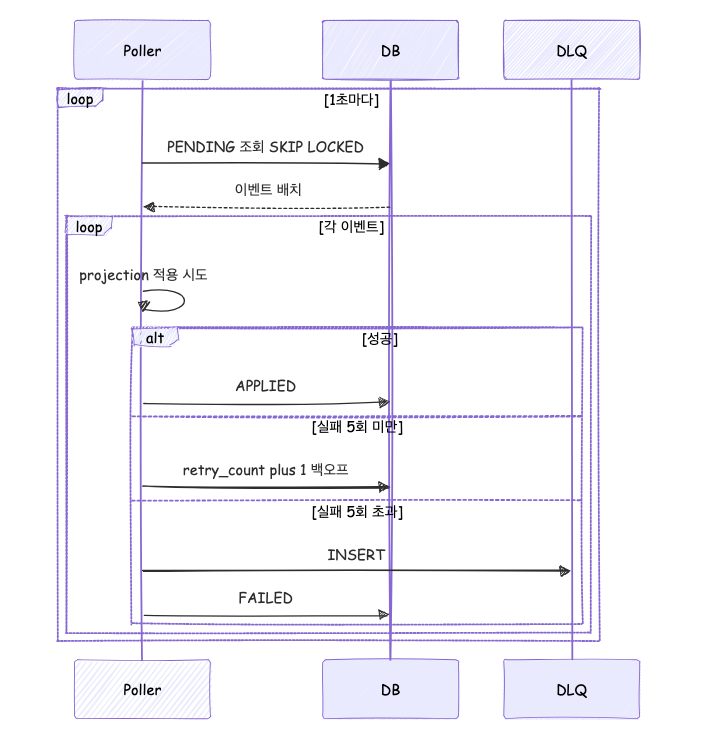

# 06. 비동기 파이프라인 (Outbox + Projection + Snapshot + DLQ)

## 1. 파이프라인 전체 흐름

```
[WebSocket Handler]
       │  (TX 시작)
       ▼
[EventAppendService]
   - events INSERT (status=PENDING)
   - sessions.last_sequence UPDATE
       │  (TX commit)
       ▼
[Redis Publisher]  (실시간 전달, projection과 독립)
       │
       ▼
[다른 WebSocket 인스턴스 → 연결된 클라이언트]

(병렬로)

[OutboxPoller @Scheduled fixedDelay=500ms]
       │  SELECT ... FOR UPDATE SKIP LOCKED LIMIT 100
       ▼
[ProjectionService]
   - session_projection UPDATE (last_applied_event_id 기반 멱등)
   - events.status = DONE
       │
       ├─ 실패 시 retry_count++, next_retry_at = now() + backoff
       │
       └─ retry_count > MAX (5) → dead_letter_events 이관
       │
       ▼
[SnapshotService @Scheduled (또는 threshold 기반)]
   - 세션당 이벤트 100개 도달 시 스냅샷 생성
```

## 2. 아웃박스 워커 설계

### 2.1 동작 — 2단계 트랜잭션



`OutboxPoller`는 **배치 ID 조회 트랜잭션**과 **이벤트별 처리 트랜잭션**을 분리해 운영한다.
이렇게 한 이유:

- SKIP LOCKED로 잡은 row 락을 짧게 유지해, 다른 워커가 다음 사이클에서 빨리 다음 batch를 잡을 수 있도록.
- 단일 이벤트의 apply 실패가 batch 전체를 롤백시키지 않도록.
- `session_projection.last_applied_event_id`로 멱등성이 보장되므로 batch 락 없이도 중복 적용은 차단된다.

```java
@Scheduled(fixedDelayString = "${app.outbox.poll-interval-ms:500}")
public void scheduled() { drain(); }

public void drain() {
    MDC.put("batchId", UUID.randomUUID().toString());
    try {
        // Step 1: 배치 ID만 SKIP LOCKED로 조회 후 트랜잭션 즉시 종료 (락 해제)
        List<EventIdProjection> ids = batchReadTemplate.execute(s ->
                eventRepository.fetchPendingEventIds(batchSize));

        if (ids == null || ids.isEmpty()) return;

        for (EventIdProjection id : ids) {
            processOne(id.getSessionId(), id.getSequence());
        }
    } catch (Exception ex) {
        // @Scheduled 예외 swallow 방지 + 다음 사이클 대기
        log.warn("Outbox polling failed, will retry next cycle", ex);
    } finally {
        MDC.remove("batchId");
    }
}

private void processOne(Long sessionId, Long sequence) {
    // Step 2-a: apply + DONE 마킹 (단일 트랜잭션). 실패 시 setRollbackOnly + ApplyFailure 반환.
    ApplyFailure failure = eventProcessTemplate.execute(status -> {
        Event event = eventRepository.findBySessionIdAndSequence(sessionId, sequence).orElse(null);
        if (event == null || event.getProjectionStatus() != ProjectionStatus.PENDING) {
            return null;  // 다른 워커가 이미 처리했거나 DONE/FAILED
        }
        try {
            projectionService.apply(event);
            eventRepository.updateProjectionStatus(sessionId, sequence,
                    ProjectionStatus.DONE, event.getRetryCount(), event.getNextRetryAt(), null);
            snapshotService.createSnapshotIfNeeded(event);
            return null;
        } catch (Exception ex) {
            status.setRollbackOnly();
            return new ApplyFailure(event, ex);
        }
    });

    if (failure == null) return;

    // Step 2-b: 실패 처리는 신규 트랜잭션. 부모 트랜잭션이 롤백돼도 status UPDATE는 보존.
    eventProcessTemplate.execute(s -> { handleFailure(failure.event(), failure.error()); return null; });
}
```

### 2.2 핵심 쿼리 (Native, EventIdProjection)

```sql
-- EventRepository.fetchPendingEventIds — 인터페이스 프로젝션으로 (session_id, sequence)만 조회
SELECT session_id AS sessionId, sequence AS sequence
FROM events
WHERE projection_status = 'PENDING'
  AND next_retry_at <= CURRENT_TIMESTAMP(3)
ORDER BY id ASC
LIMIT :limit
FOR UPDATE SKIP LOCKED
```

- **인터페이스 프로젝션**으로 `id/sequence`만 받고 본문 컬럼은 처리 단계에서 `findBySessionIdAndSequence`로 재조회. 영속성 컨텍스트 오염 방지.
- **FAILED 미포함**: SKIP LOCKED 조회는 PENDING만. FAILED는 DLQ retry API가 PENDING으로 리셋한 뒤 다음 폴링 사이클에서 다시 잡힌다.
- **트랜잭션 경계:** Step 1은 ID 조회 직후 즉시 commit하여 행 락 해제. 이벤트별 처리는 Step 2의 별도 짧은 트랜잭션.

### 2.3 멱등성 보장

- `SessionProjectionRepository.upsertProjection`는 `INSERT ... ON DUPLICATE KEY UPDATE` 단일 쿼리에서
  `last_applied_event_id < new.last_applied_event_id` 조건일 때만 갱신한다 (`AS new` row alias 사용, MySQL 8.0.20+).
- 이미 적용된 이벤트는 카운터 증가 없이 통과 → 두 워커가 같은 이벤트를 잡아도 안전.

### 2.4 재시도 정책 (지수 백오프)

`OutboxPoller.handleFailure`의 실제 동작:

```java
int nextRetry = event.getRetryCount() + 1;
if (nextRetry >= maxRetry) { moveToDeadLetter(...); return; }
long backoffSeconds = 1L << nextRetry;  // 2, 4, 8, 16
LocalDateTime nextAt = LocalDateTime.now().plusSeconds(backoffSeconds);
```

| nextRetry | backoff | 다음 시도 시각 | 결과 |
|---|---|---|---|
| 1 | 2 sec | now+2s | PENDING 유지, retry_count=1 |
| 2 | 4 sec | now+4s | PENDING 유지, retry_count=2 |
| 3 | 8 sec | now+8s | PENDING 유지, retry_count=3 |
| 4 | 16 sec | now+16s | PENDING 유지, retry_count=4 |
| 5 | — | — | **DLQ 이관 + 원본 events FAILED** |

**총 4회 재시도 후 5번째 실패에서 DLQ 이관.** `app.outbox.max-retry`(기본 5)로 임계치 설정.

### 2.5 동시성
- 워커 여러 인스턴스 실행: Spring Boot 서버 2대 × 기본 1 스레드 = 2 워커
- `SKIP LOCKED` 덕분에 row-level 경합 없음
- 배치 크기 100으로 제한 → 장애 시 재처리 부담 제한

## 3. Dead Letter Queue (DLQ)

### 3.1 이관 시점
- `retry_count >= MAX_RETRY (5)` 도달 시
- 명시적 "재생 불가" 예외 (예: 역직렬화 불가능한 payload)

### 3.2 DLQ 운영 API (가산점)
- `GET /admin/dlq` — 미처리 건 조회
- `POST /admin/dlq/{id}/retry` — 수동 재처리 (events로 복원)
- `DELETE /admin/dlq/{id}` — 영구 폐기
- 관리자 전용 인증은 과제 Non-goals라 생략, 설계 문서에만 언급

### 3.3 메트릭
- `chat.projection.dead_letter` — Counter, `tag: reason=ExceptionClassName` (Micrometer 등록 이름. Prometheus export 시 `chat_projection_dead_letter_total`로 노출)
- Grafana 경고 룰: 1시간 내 > 0 → Slack/email 알림 (설계만, 미구현)

## 4. Snapshot 생성

### 4.1 트리거 — 자동화만, 수동 API 없음

상세 규칙은 `docs/05-event-sourcing.md` §3.3을 단일 진실 원본으로 삼는다. 본 절은 비동기 파이프라인 관점의 요약.

| 트리거 | 호출 위치 | 조건 |
|---|---|---|
| 이벤트 카운트 기반 | `OutboxPoller.processOne` 직후 `SnapshotService.createSnapshotIfNeeded` | `session_projection.message_count % app.snapshot.event-threshold(=100) == 0` |
| 세션 종료 봉인 | `SessionService.endSession` → `SnapshotService.createFinalSnapshot` | `latest.lastSequence < session.lastSequence` (잔여 이벤트가 있을 때만) |

**수동 트리거 API(`POST /sessions/{id}/snapshots` 등)는 제공하지 않는다.** 운영자가 강제로 상태를 다시 만들고 싶을 때는 `POST /admin/projections/rebuild?sessionId=...`를 사용해 projection을 재구성한다.

### 4.2 생성 절차
```
1. 최신 snapshot 조회. 있으면 deserialize, 없으면 빈 SessionState로 시작
2. snapshot.lastSequence 이후 이벤트 전체 조회 → StateEventApplier로 순차 apply
3. 결과 SessionState를 직렬화 (snapshotObjectMapper, ORDER_MAP_ENTRIES_BY_KEYS=true)
4. INSERT INTO snapshots (session_id, version=prev+1, last_event_id, last_sequence, state_json)
5. RETENTION=3 — version < (nextVersion - 2) 인 오래된 row를 native DELETE
```

### 4.3 결정론성 보장
- `StateEventApplier`는 외부 시간/랜덤 의존이 없는 순수 함수
- 직렬화 시 `ORDER_MAP_ENTRIES_BY_KEYS=true` + TreeMap/LinkedHashMap 사용으로 키 순서 안정
- 동일 이벤트 스트림 → 동일 stateJson (유닛 테스트 `SnapshotServiceTest`에서 검증)
- `createFinalSnapshot`은 `REQUIRES_NEW` 트랜잭션으로 격리되어 세션 종료 커밋과 독립적으로 실패할 수 있다

## 5. Idempotency Key 정리

| 레벨 | 키 | 구현 |
|---|---|---|
| 이벤트 수집 | `(session_id, client_event_id)` | DB UNIQUE |
| Projection 적용 | `last_applied_event_id` | UPDATE WHERE 조건 |
| Redis publish | 허용 at-least-once | 클라이언트측 dedupe (`clientEventId`) |
| 스냅샷 생성 | `(session_id, version)` | PK 충돌 시 skip |

## 6. 메트릭 (관측)

본 파이프라인이 노출하는 메트릭은 `ChatMetrics`(`src/main/java/com/example/chat/common/metrics/`)에 정의된 실제 구현 기준이다. 자세한 전체 목록은 `docs/07-observability.md` §2 참조.

| 메트릭 | 타입 | 설명 |
|---|---|---|
| `chat.outbox.pending.size` | Gauge | 현재 PENDING 이벤트 수 (`countByProjectionStatus(PENDING)`) |
| `chat.outbox.lag.seconds` | Gauge | 가장 오래된 PENDING 이벤트의 `server_received_at`과 now 차이(초) |
| `chat.projection.dead_letter` | Counter | DLQ 이관 카운터. `tag: reason=ExceptionClassName` |

> 다음 메트릭은 설계 단계에서 거론됐으나 본 구현에는 포함되어 있지 않다 — 추가 도입 시 `ChatMetrics`에 빌드:
> `chat.outbox.processed.total`, `chat.outbox.failed.total`, `chat.projection.apply.duration`, `chat.snapshot.created.total`.

## 7. 장애 격리

- 아웃박스 파이프라인 정체 ≠ 실시간 전달 중단 (Redis Pub/Sub 경로 독립)
- Redis 장애 ≠ 이벤트 저장 중단 (DB 저장은 성공, publish만 fallback)
- DB 장애 → 전체 영향, 단일 장애 도메인

## 8. Projection Rebuild (운영용)

### 8.1 필요성
- projection 로직 버그 수정 후 기존 데이터 재계산 필요
- 이벤트 소싱의 핵심 이점 — "이벤트가 진실의 원천, projection은 언제든 재계산 가능"

### 8.2 API
- `POST /admin/projections/rebuild?sessionId={id}` — 특정 세션의 `session_projection` row를 지우고 처음부터 이벤트 리플레이로 재구성 (`AdminProjectionController` + `ProjectionRebuildService`)
- 전체 재구축(`/rebuild-all`)은 본 구현에 포함되어 있지 않다. 필요 시 세션 ID 목록을 받아 위 엔드포인트를 반복 호출하는 운영 스크립트로 대체.

### 8.3 구현 플로우
```
1. session_projection 기존 row 삭제 (또는 초기화)
2. events 테이블에서 session_id 조건으로 전체 이벤트 조회 (sequence 정렬)
3. empty state로 시작, applyEvent를 순차 실행
4. 최종 projection INSERT
5. 필요 시 snapshots 재생성
```

### 8.4 안전장치
- ACTIVE 세션 거부 로직은 두지 않는다. 대신 `sessions` 행에 `PESSIMISTIC_WRITE` 락을 걸어 rebuild와 신규 이벤트 append를 직렬화한다 (`ProjectionRebuildService`가 `findWithLockById`로 동일 락 사용).
- 단일 세션만 타겟이며, 전체 일괄 재구축은 운영자가 외부 스크립트로 트리거.
- 처리 진행률 메트릭(`chat.projection.rebuild.progress` 등)은 본 구현에 포함되어 있지 않다 — 추가 시 `ChatMetrics`에 빌드.

## 9. Rate Limiting / Backpressure (서비스 관점 설계 문서용)

### 9.1 필요성
- 악의적/오류 클라이언트의 이벤트 폭주 방지
- 서비스 전체 안정성 보호

### 9.2 제안 설계 (구현 없이 설계 문서에만)
- **세션당 rate limit**: Redis `INCR session:{id}:rate:{sec}` + `EXPIRE 1`
- **사용자당 rate limit**: `INCR user:{id}:rate:{sec}`
- 한도 초과 시 `ERROR` 프레임 + 일시 차단 (TTL 5초)
- **토큰 버킷 또는 leaky bucket** 알고리즘 후일 도입

### 9.3 구현 범위 (본 과제)
- 본 과제에서는 **문서에만 제안**, 실제 구현 생략 (일정 우선순위)

## 10. 확장 경로 (문서용)

현재 구현이 트래픽 한계에 도달하면 (이벤트/초 1K 이상):
1. **Kafka 전환**: `events` INSERT 후 Kafka producer로 topic publish, 별도 consumer group이 projection 처리
2. **Marzullo 알고리즘 또는 hybrid logical clock**: 다중 서버 동시 쓰기에서 sequence 충돌 방지
3. **읽기 전용 replica**: 복원 쿼리를 read replica로 분리

### 10.1 Hot/Warm/Cold 티어링 (서비스 관점)
- **Hot (최근 7일)**: MySQL `events` 테이블
- **Warm (7일~90일)**: MySQL archive 테이블 또는 S3 Parquet
- **Cold (90일+)**: S3 Glacier / 압축 저장
- 복원 요청이 warm/cold 영역을 참조하면 lazy load + 캐시
- 본 과제에서는 설계 문서 섹션으로만 제시, 구현 생략
